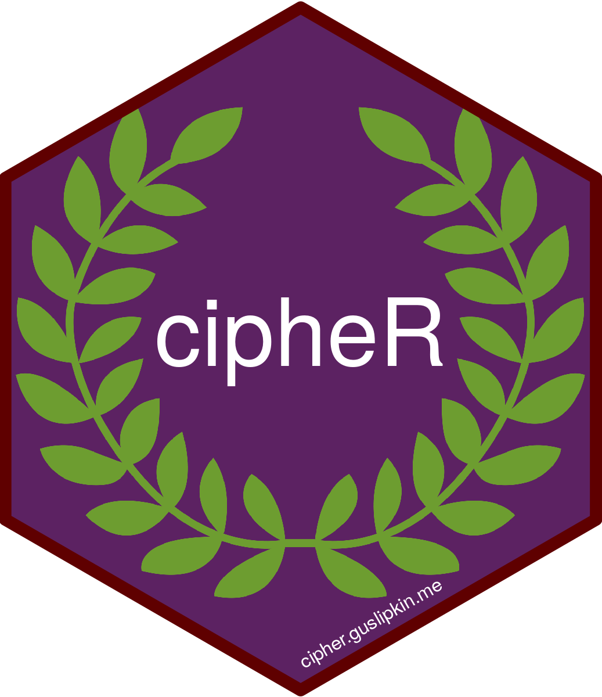

<!-- badges: start -->
[](https://github.com/guslipkin/cipheR/actions/workflows/R-CMD-check.yaml)
<!-- badges: end -->

# cipheR 
An R library for simple text ciphers.

## Install Process

### From CRAN

```R
install.packages("cipheR")
```

### From Source

```R
install.packages("devtools")
devtools::install_github("guslipkin/cipheR")
```
